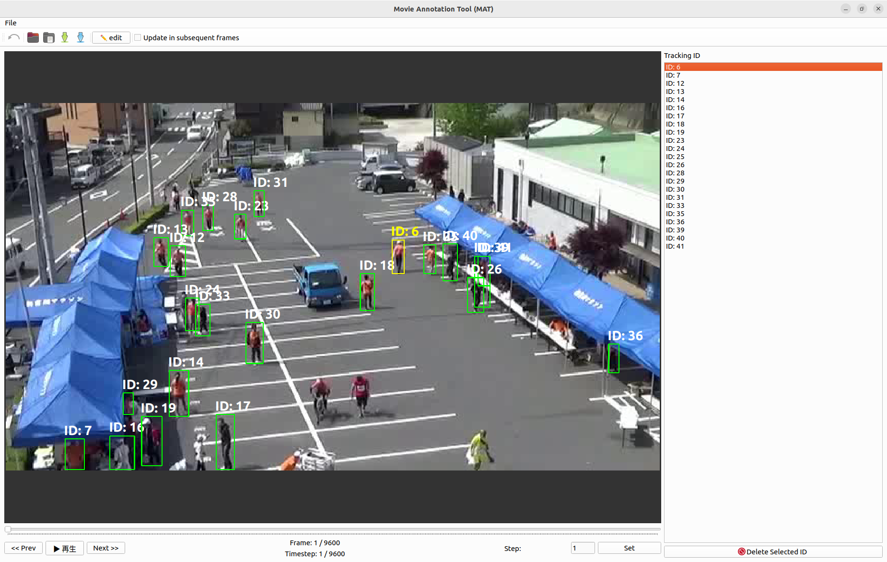

# Tracker Annotation Tool

**Tracker Annotation Tool** is a Python-based GUI application designed to visualize and refine tracking data (BBox and IDs) generated by object tracking algorithms like YOLO.
It provides an efficient workflow for correcting ID switches, removing false positives, and adding missing detections with a user-friendly interface.



## 🚀 Features (機能)

- **Visual Validation**: Overlay bounding boxes and tracking IDs on video frames.
- **Edit**: 
  - **ID Correction**: Batch update IDs for a single frame or all subsequent frames.
  - **Deletion**: Remove specific BBoxes (single frame or subsequent frames).
- **Safety & Logging**: 
  - **Undo/Redo**: Support for `Ctrl + Z` to revert changes.
  - **Operation Log**: Automatically records all modification actions to a CSV file.
- **Navigation**:
    - Keyboard shortcuts for frame stepping.
    - **Timestep**: Customizable frame skipping interval for fast review and sparse data saving.

## 📦 Requirements

### Dev Environment

- Python: 3.13.9
- PyQt6: 6.10.0
- opencv-python: 4.12.0.88
- pandas: 2.3.3

Please install the remaining libraries as needed.. (´｡･д人)

## 🔧 Usage

### 1. Launch

```bash
python main.py
```

### 2. Load Files

1. Click Open Movie File (Folder icon) to load a video (.mp4).
2. Click Open Tracking File (Document icon) to load the tracking data (.csv).

### 3. Controls

|Function|Key / Action|Description|
|:---|:---|:---|
|Play / Pause|Space,Toggle video playback.|
|Prev / Next Frame|A / D or ← / →|Navigate frames (based on Step setting).|
|Select ID|Click (List)|Highlight a specific ID in the list.|
|Edit ID|Double Click (List)|Modify the selected ID.|
|Delete ID|Delete|Delete the selected ID/BBox.|
|Toggle Edit Mode|W|Enable/Disable BBox creation mode.|
|Add BBox|Drag (on Video)|Draw a new BBox (only in Edit Mode).|
|Undo|Ctrl + Z|Revert the last action.|

### 4. Output
- **Save Data**: Saves the corrected tracking data. If a Step is set, data is filtered by that interval.
- **Save Log**: Exports the modification history to a CSV file for analysis.

## 📄 Data Format

### 📸 Input/Output: Tracking data

Example:
```csv: sample_tracking.csv
frame,tracker_id,class,x,y,w,h
1,6,0,0.601491,0.41903,0.0201744,0.09235
1,7,0,0.1059,0.957619,0.0300358,0.0847612
1,12,0,0.264597,0.434376,0.0235488,0.086073
```
(note) The values in the x, y, w, and h columns are normalized coordinates (0.0 - 1.0).

## 🤝 Development Workflow

We follow the GitHub Flow.

1.  **Fork** the repository (or create a branch if you have access).
2.  Create a feature branch: `git checkout -b feature/your-feature-name`
3.  Commit your changes.
4.  Push to the branch: `git push origin feature/your-feature-name`
5.  Submit a **Pull Request** to the `main` branch. 
(note) Don't merge it directly into the `main` branch.